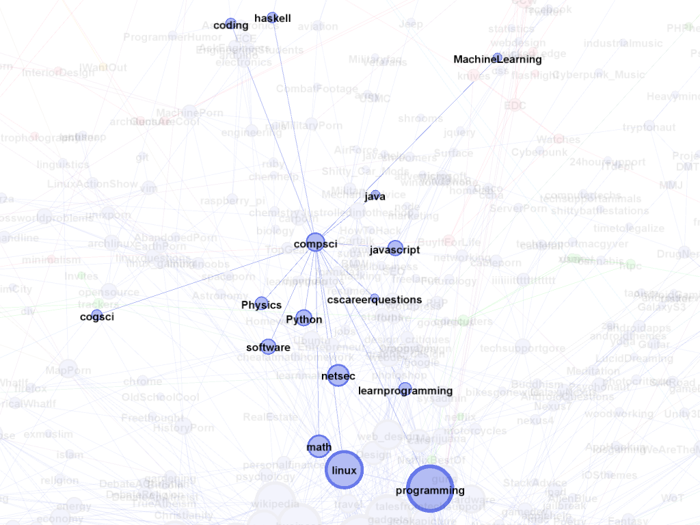

# Reddit Community Detection

Code for a survey of community detection algorithms on Reddit data described in [Detection and Analysis of Subreddit Communities](detection_and_analysis_of_subreddit_communities.pdf).

Preprocessed Subreddit Communities: 
")

Labeled Graph:

Computer science subgraph:

